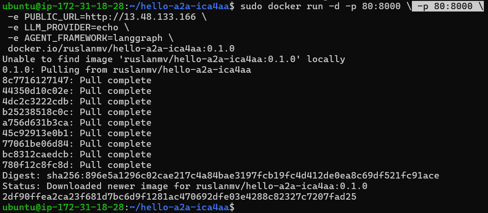
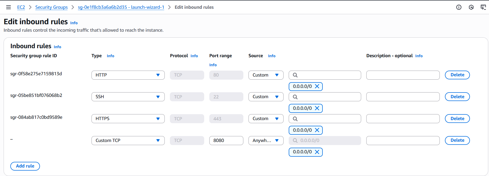

# Hello World A2A (ICA4AA-ready)

A tiny, production-friendly agent that **uses** the `universal-a2a-agent` package (from PyPI) and adds **ICA4AA**-friendly discovery endpoints. It’s perfect as a starter template for teams who want a small agent they can run anywhere (a single VM, EC2 instance, IBM Code Engine, or Kubernetes), yet still integrate cleanly with orchestration platforms that speak **A2A**.

---

## Why this template?

Most “hello world” agents are either coupled to a specific LLM vendor, or demo-only. This one is different:

* **Vendor-neutral runtime.** We reuse Universal A2A’s pluggable provider layer (Watsonx, OpenAI, Ollama, etc.) and framework layer (LangGraph, LangChain, CrewAI…).
* **Interoperable protocols.** You get **A2A**, **JSON-RPC 2.0**, and an **OpenAI-compatible** route in a single service.
* **ICA4AA-ready discovery.** It exposes `/a2a/manifest` and `/a2a/agents` so **Builder Studio** can import via:

  1. Upload YAML, 2) Directory listing, or 3) Base URL (manifest auto-discover).
* **Portable & simple.** Run on a laptop, a single VM, container platforms (Code Engine), or Kubernetes.

**TL;DR:** one small container; a clean HTTP surface; pluggable brains inside. Keep clients stable as your internals evolve.

---

## What’s newly added (for ICA4AA imports)

* `/.well-known/ica4aa/agents` and `/api/v1/agents` discovery endpoints (same payload).
* `/api/v1/agents/{agent_id}/invoke` wrapper for a clean invoke URL.
* Enriched `/a2a/manifest` and `/a2a/agents` to include `endpoints`, `auth`, and input/output schemas.
* CORS enabled (allow-all) so browser-based discovery works behind HTTPS frontends.

---

## Project layout (quick glance)

```
hello-a2a-ica4aa/
├─ README.md
├─ requirements.txt
├─ agent.yaml                     # for “Upload Agent YAML File” flow
├─ .env.example
├─ Dockerfile
├─ k8s/
│  └─ hello-a2a-ica4aa.yaml       # optional, if you use Kubernetes
└─ src/
   └─ hello_a2a_ica4aa/
      ├─ __init__.py
      └─ service.py               # extends the Universal A2A FastAPI app
```

---

## 1) Local development (no Kubernetes required)

> Works on macOS, Linux, and WSL on Windows. You just need Python 3.11+.

```bash
python -m venv .venv && source .venv/bin/activate
pip install -r requirements.txt

# minimal dev env
export PUBLIC_URL=http://localhost:8000
export LLM_PROVIDER=echo
export AGENT_FRAMEWORK=langgraph

# run the app
uvicorn --app-dir src hello_a2a_ica4aa.service:app --host 0.0.0.0 --port 8000
```

Or with the included **Makefile**:

```bash
make run
```

### Smoke tests

```bash
# Manifest (for “Agent Endpoint URL” import flow)
curl -s http://localhost:8000/a2a/manifest | jq

# Directory listing (for “Get Agents from A2A Server” flow)
curl -s http://localhost:8000/a2a/agents | jq

# ICA4AA-style action
curl -s -X POST http://localhost:8000/a2a/actions/say_hello \
  -H 'Content-Type: application/json' \
  -d '{"name":"ICA4AA"}' | jq

# Universal A2A (raw)
curl -s http://localhost:8000/a2a -H 'Content-Type: application/json' -d '{
  "method":"message/send",
  "params":{"message":{"role":"user","messageId":"m1","parts":[{"type":"text","text":"ping"}]}}
}' | jq
```

Open the interactive docs: [http://localhost:8000/docs](http://localhost:8000/docs)

---

## 2) Run as a container (single VM, EC2, Code Engine—your choice)

Build the image:

```bash
# Build locally
make container-build IMAGE=docker.io/ruslanmv/hello-a2a-ica4aa:0.1.0
```

Run it anywhere that has Docker:

```bash
# On a VM or EC2:
make container-run IMAGE=docker.io/ruslanmv/hello-a2a-ica4aa:0.1.0 PORT=8000 \
  ENV='PUBLIC_URL=http://<public-host-or-ip>:8000 LLM_PROVIDER=echo AGENT_FRAMEWORK=langgraph'
```

Manual (without Makefile):

```bash
docker run --rm -p 8000:8000 \
  -e PUBLIC_URL=http://<public-host-or-ip>:8000 \
  -e LLM_PROVIDER=echo \
  -e AGENT_FRAMEWORK=langgraph \
  docker.io/ruslanmv/hello-a2a-ica4aa:0.1.0
```

> **Tip (prod-ish):** Put your container behind a TLS proxy (Nginx, Traefik, ALB/ELB, Code Engine HTTPS). Then set `PUBLIC_URL=https://your-domain` so manifests/links are correct.

---

## 3) AWS EC2 example — using your public IP

Assume your EC2 instance exposes the app at **[http://13.48.133.166:8080/](http://13.48.133.166:8080/)**.

Run the container mapping EC2 port 8080 → app port 8000 and set `PUBLIC_URL` accordingly:

```bash
sudo docker run -d --name hello-a2a-ica4aa \
  -p 8080:8000 \
  -e PUBLIC_URL=http://13.48.133.166:8080 \
  -e LLM_PROVIDER=echo \
  -e AGENT_FRAMEWORK=langgraph \
  docker.io/ruslanmv/hello-a2a-ica4aa:0.1.0
```



Open Security Group for inbound TCP 8080 (or 8000 if you mapped that directly).



### Is it running?

```bash
sudo docker ps -a --filter name=hello-a2a-ica4aa
sudo docker logs -f hello-a2a-ica4aa   # tail logs
```

**Health check**

```bash
curl -s http://13.48.133.166:8080/healthz | jq .
```

**Docs / OpenAPI**

Visit: [http://13.48.133.166:8080/docs](http://13.48.133.166:8080/docs)

**Discovery (optional checks)**

```bash
curl -s http://13.48.133.166:8080/.well-known/ica4aa/agents | jq .
curl -s http://13.48.133.166:8080/api/v1/agents | jq .
```

**Invoke test**

```bash
curl -s -X POST http://13.48.133.166:8080/api/v1/agents/hello-world/invoke \
  -H 'Content-Type: application/json' \
  -d '{"name":"Ada"}' | jq .
```

### Updated `agent.yaml` for EC2 public IP

Use this for **Upload Agent YAML File** in Builder Studio. It references the EC2 public IP/port directly so ICA4AA can invoke and health-check your agent.

```yaml
# agent.yaml
# Use this for “Upload Agent YAML File” in Builder Studio.
# Replace YOUR-HOST with the externally reachable HTTPS host.
apiVersion: a2a/v1
kind: Agent
metadata:
  id: hello-world
  name: Hello World
  version: "1.2.0"
  description: Universal A2A Hello
spec:
  endpoints:
    invoke: http://13.48.133.166:8080/api/v1/agents/hello-world/invoke
    health: http://13.48.133.166:8080/healthz
  auth:
    type: none
  inputSchema:
    type: object
    required: [name]
    properties:
      name:
        type: string
        description: Name to greet
  outputSchema:
    type: object
    required: [message]
    properties:
      message:
        type: string
```

> If you terminate TLS in front of the instance (ALB/ELB, Nginx, Traefik, Caddy, etc.), swap the URLs to **https://** and set `PUBLIC_URL=https://your-domain`.

---

## 4) Import into Builder Studio (ICA4AA) — Detailed Step-by-Step

Below is an explicit walkthrough to import the EC2-hosted A2A agent (running at `http://13.48.133.166:8080`) into **ICA4AA**.

### A) Create (or open) your app

**Getting started with Creating an Agentic App**
Begin your journey by selecting **Create New Agentic App**. Fill in the required fields including **name**, **description**, and **category** to help organize your application within the platform.

Once your app is created, it will appear in the **dashboard** view and from there, you can further edit it (defining MCP servers, agents, workflows).

*Tip:* Use categories to group apps by use case (e.g. Marketing, Finance) and track drafts vs. live deployments.

Alternatively, you can view your existing applications previously created and you can edit each, clicking the individual app **Edit** button which will navigate you to the same dashboard view as above.

### B) Open the Agents section

From your app’s **Application Overview Dashboard**, find the **Agents** card and click **Edit** (or **Add Agent**).


### C) Choose how to onboard the agent

In **Agent Orchestration Setup Guide**, you can onboard agents via:

* **Upload Agent YAML File**
* **Get Agents from A2A Server**
* **Agent Endpoint URL** (a base URL; the platform will auto-discover)

You’ll also see options like **Create Multi Agent Orchestration** (when composing multiple agents). For this Hello World example, a single agent import is fine.

#### Option 1 — Upload Agent YAML File (recommended for EC2 IP)

1. Click **Upload Agent YAML File**.
2. Paste/upload the **EC2 agent.yaml** shown above (with your **actual** IP/port already filled):

   * `invoke: http://13.48.133.166:8080/api/v1/agents/hello-world/invoke`
   * `health:  http://13.48.133.166:8080/healthz`
3. Click **Next** → review → **Import**.

#### Option 2 — Get Agents from A2A Server (directory endpoint)

1. Click **Get Agents from A2A Server**.
2. **Agent Endpoint URL** → provide one of these discovery URLs:

   * `http://13.48.133.166:8080/.well-known/ica4aa/agents`
   * `http://13.48.133.166:8080/api/v1/agents`
3. Click **Next**. You should see the **Hello World** agent listed; select it → **Import**.

#### Option 3 — Agent Endpoint URL (base URL; manifest auto-discovery)

1. Click **Agent Endpoint URL**.
2. **Enter agent endpoint URL** → `http://13.48.133.166:8080`

   * The importer will probe `/.well-known/ica4aa/agents` and `/a2a/manifest` automatically.
3. Click **Next** → review → **Import**.

> **What should the Endpoint URL contain?**
>
> * For **Upload YAML**: you don’t need an Endpoint URL; you need a correct YAML (see above).
> * For **Get Agents from A2A Server**: use the **directory** endpoint (recommended):
>   `http://13.48.133.166:8080/.well-known/ica4aa/agents` (or `/api/v1/agents`).
> * For **Agent Endpoint URL**: use the **base** URL:
>   `http://13.48.133.166:8080`.

### D) Verify the imported agent

After import, the **Agents** section should show your agent with a proper **name** (Hello World) and **Version** (1.2.0). If you previously had rows titled **Unknown A2A Agent** with **Failed**, they should no longer appear for this agent.

You can now bind this agent into **workflows**, test **tools** (if any), and wire it to UI or other agents.

---

## 5) Optional: Kubernetes (if you have a cluster)

If your ICA4AA stack runs in Kubernetes, apply the sample manifest:

```bash
kubectl apply -n ica4aa-builder-studio -f k8s/hello-a2a-ica4aa.yaml
```

In-cluster URL:

```
http://hello-a2a-ica4aa.ica4aa-builder-studio.svc.cluster.local:8000
```

---

## 6) Switching providers & frameworks

Because this reuses Universal A2A under the hood, you don’t touch code—just change environment variables.

**Watsonx.ai example**

```bash
export LLM_PROVIDER=watsonx
export WATSONX_API_KEY=...
export WATSONX_URL=https://us-south.ml.cloud.ibm.com
export WATSONX_PROJECT_ID=...
export MODEL_ID=ibm/granite-3-3-8b-instruct
```

**OpenAI example**

```bash
export LLM_PROVIDER=openai
export OPENAI_API_KEY=...
# optional: OPENAI_BASE_URL=https://api.openai.com/v1
```

**Ollama example (local models)**

```bash
export LLM_PROVIDER=ollama
export OLLAMA_BASE_URL=http://localhost:11434
export MODEL_ID=llama3
```

**Framework style**

```bash
export AGENT_FRAMEWORK=langgraph    # or: crewai | langchain | native
```

Restart the container/process; **your HTTP API and ICA4AA routes remain the same**.

---

## 7) Configuration (env vars you’ll care about)

* **PUBLIC_URL** – the public base URL of this service (used in manifests/links).
* **LLM_PROVIDER** – `echo` (no external calls), `watsonx`, `openai`, `ollama`, `anthropic`, `gemini`, `azure_openai`, `bedrock`.
* **AGENT_FRAMEWORK** – `langgraph` (default), `crewai`, `langchain`, or `native`.
* **A2A_BACKEND_BASE** – (optional) if you want `/a2a/actions/say_hello` to call a **remote** Universal A2A backend instead of the same container.

Plus provider-specific credentials (see examples above).

---

## 8) API surface (what’s exposed)

**Discovery & health**

* `GET /a2a/manifest` – single-agent manifest (for “Agent Endpoint URL” imports)
* `GET /a2a/agents` – directory listing (for “Get Agents from A2A Server” imports)
* `GET /.well-known/ica4aa/agents` – well-known directory (recommended for discovery)
* `GET /api/v1/agents` – compatibility directory
* `GET /healthz` – liveness
* `GET /readyz` – readiness (provider/framework reasons included)
* `GET /.well-known/agent-card.json` – A2A Agent Card (standard discovery doc)

**Core A2A & optional shims (from Universal A2A)**

* `POST /a2a` – raw A2A envelope
* `POST /rpc` – JSON-RPC 2.0 (`method: "message/send"`)
* `POST /openai/v1/chat/completions` – OpenAI-compatible route (great for UIs)

**Demo action (ICA4AA style)**

* `POST /a2a/actions/say_hello` – accepts `{ "name": "…" }`, replies with `{ "message": "…" }`

Implementation note: it **delegates** to the Universal A2A `/a2a` route under the hood, so it uses whatever provider/framework you configured.

---

## 9) Makefile cheat sheet

```bash
# Run locally (loads venv if present)
make run

# Build a container image
make container-build IMAGE=docker.io/ruslanmv/hello-a2a-ica4aa:0.1.0

# Run the container
make container-run IMAGE=docker.io/ruslanmv/hello-a2a-ica4aa:0.1.0 PORT=8000 \
  ENV='PUBLIC_URL=http://<host>:8000 LLM_PROVIDER=echo AGENT_FRAMEWORK=langgraph'
```

> Prefer `make` because it passes env cleanly and keeps commands consistent across devs.

---

## 10) Troubleshooting

* **Mixed content blocked (HTTPS UI → HTTP agent)**
  Expose the agent behind HTTPS or ensure the platform performs **server-side** fetches. Best: put a TLS proxy in front and set `PUBLIC_URL=https://…`.

* **Wrong host in manifest**
  Set `PUBLIC_URL` to the externally reachable base (e.g., `http://13.48.133.166:8080` on EC2, or your HTTPS domain).

* **Security groups / firewall**
  Open the port you mapped (8080 in the example).

* **Endpoint URL confusion**

  * **Upload YAML**: no endpoint URL; use the YAML with full URLs.
  * **Get Agents from A2A Server**: `http://13.48.133.166:8080/.well-known/ica4aa/agents` (or `/api/v1/agents`).
  * **Agent Endpoint URL**: `http://13.48.133.166:8080` (base).

* **Still seeing “Unknown A2A Agent”**

  * Confirm the service is up: `curl -s http://13.48.133.166:8080/healthz`.
  * Confirm discovery returns JSON: `curl -s http://13.48.133.166:8080/.well-known/ica4aa/agents | jq .`.
  * Check CORS/mixed-content if the platform fetches from browser context.
  * Ensure `/api/v1/agents/hello-world/invoke` responds to POST.
  * Verify `PUBLIC_URL` matches what ICA4AA can reach (no NAT-only addresses).
